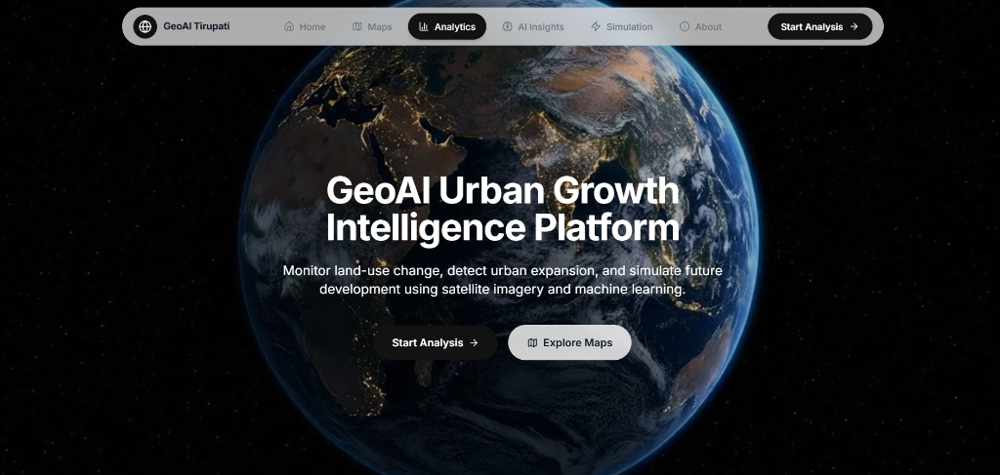

# GeoAI Urban Growth Intelligence

<div align="center">


[](https://geo-ai-urban-intelligence.vercel.app/)
[](http://localhost:8888/docs)
[](#11-setup)

[](#)
[](#)
[](#)
[](#)
[](#)

</div>

---

## 1. 🔥 Hero Section

### GeoAI Urban Growth Monitoring

**A futuristic geospatial intelligence platform for Land Use / Land Cover monitoring, change detection, risk alerts, hotspot analysis, and policy-driven simulation.**

<div align="center">

[](https://geo-ai-urban-intelligence.vercel.app/)

</div>

<div align="center">

[](https://geo-ai-urban-intelligence.vercel.app/)
[](http://localhost:8888/docs)

</div>

> ✨ Scroll to explore intelligence layers

---

## 2. 🌍 About

Urban expansion is accelerating, but planning systems often react too late.

**GeoAI** turns satellite-derived raster intelligence into decision-ready insights for planners, researchers, and city leaders. It combines a robust FastAPI backend with a modern React + Leaflet interface to deliver:

- near-instant LULC analytics
- interpretable change intelligence
- AI-based risk and hotspot signals
- scenario-based simulation for future policy choices

This is not just a dashboard. It is a **city intelligence layer** for evidence-based growth governance.

> ⬇️ Dive into the system

---

## 3. ⚡ Core Features

<table>
  <tr>
    <td width="33%">
      <h3>🛰️ Multi-City Intelligence</h3>
      <p>Configured cities plus auto-discovery from disk for scalable expansion.</p>
    </td>
    <td width="33%">
      <h3>📊 LULC Analytics</h3>
      <p>Class-wise distribution analytics with canonical 5-class reporting.</p>
    </td>
    <td width="33%">
      <h3>🔄 Change Matrix</h3>
      <p>Transition analysis across year pairs to identify transformation pathways.</p>
    </td>
  </tr>
  <tr>
    <td width="33%">
      <h3>✅ Confidence Summaries</h3>
      <p>Model confidence endpoints and map overlays for trust-aware decisions.</p>
    </td>
    <td width="33%">
      <h3>🚨 AI Risk + Hotspots</h3>
      <p>Risk surface and hotspot intelligence to prioritize intervention zones.</p>
    </td>
    <td width="33%">
      <h3>🗺️ Overlay APIs</h3>
      <p>PNG map overlays for LULC, change, confidence, hotspot, risk, and simulation.</p>
    </td>
  </tr>
</table>

> 🚀 Experience the pipeline

---

## 4. 🎬 Product Experience

### Full-Width Motion Preview

<details open>
  <summary><strong>🧭 Map Visualization Demo</strong></summary>


</details>

<details>
  <summary><strong>🔁 Change Detection Demo</strong></summary>


</details>

<details>
  <summary><strong>🚨 Risk Analysis Demo</strong></summary>


</details>

<details>
  <summary><strong>🧪 Policy Simulation Demo</strong></summary>


</details>

> ✨ Progressive reveal enabled with collapsible demo panels

---

## 5. 🧠 AI Capabilities

### Powered by GeoAI Intelligence Layer

GeoAI adds an intelligence layer on top of raw geospatial outputs:

- **Risk Alerts:** identifies vulnerable transition corridors.
- **Hotspot Discovery:** detects spatial concentration of high-impact land transitions.
- **AI Insights:** human-readable interpretation from spatial analytics.
- **Policy Simulation:** evaluates future scenarios such as:
  - `trend`
  - `agriculture_protection`
  - `green_zone_enforcement`

#### Scenario Highlights

| Scenario | What It Optimizes |
|---|---|
| `trend` | Continuation of current land transition trajectory |
| `agriculture_protection` | Reduced agricultural land loss |
| `green_zone_enforcement` | Protection of eco-sensitive urban edges |

### LULC Class Canon

| Class ID (normalized) | Label |
|---|---|
| 1 | Forest |
| 2 | Water Bodies |
| 3 | Agriculture |
| 4 | Barren Land |
| 5 | Built-up |

Supported raster schemas are normalized internally before analytics:

- `0..4` (zero-based)
- `1..5` (legacy one-based)

> ⬇️ Next: how everything connects end-to-end

---

## 6. 🗺️ System Architecture

```text
Earth Engine + RF Pipeline
        |
        v
   GeoTIFF Outputs
        |
        v
FastAPI Geospatial Services
(raster, analytics, AI, map routes)
        |
        v
React + Leaflet Frontend
        |
        v
Interactive Decision Experience
```

### Architecture Storyline

- **Data Layer:** raw raster intelligence is versioned by city and year.
- **Service Layer:** FastAPI routes expose analytics, overlays, and AI endpoints.
- **Experience Layer:** React + Leaflet turns API outputs into guided decision workflows.

### Architecture Snapshot

| Layer | Responsibility |
|---|---|
| Data Layer | GeoTIFF rasters in `data/gee_outputs` |
| Service Layer | FastAPI routes + raster/analytics/AI services |
| Presentation Layer | React + TypeScript + Leaflet map UX |

> 🚀 Journey continues from Earth -> AI -> API -> UI -> Decision

---

## 7. 🔄 Data Pipeline

From raw earth observation to actionable city intelligence:

1. **Earth Engine + Random Forest** generates thematic rasters.
2. **GeoTIFF files** are organized city-wise by domain (`lulc`, `change`, `confidence`).
3. **FastAPI backend** parses years from filenames and serves analytics/maps.
4. **React frontend** converts API outputs into interactive insights and map experiences.

### Data Layout Requirements

```text
data/gee_outputs/<city>/lulc/*.tif
data/gee_outputs/<city>/change/*.tif
data/gee_outputs/<city>/confidence/*.tif
```

Year and pair extraction is filename-based (4-digit year regex), so include years in names, for example:

- `lulc_2025.tif`
- `City_LULC_Change_2018_2025.tif`

---

## 8. 🛠️ Tech Stack

<div align="center">


</div>

---

## 9. 📁 Project Structure

```text
.
|-- app/
|   |-- config/            # Backend config (data dir, city mapping)
|   |-- routes/            # FastAPI route modules
|   |-- services/          # Raster + analytics + AI logic
|   `-- main.py            # FastAPI app entrypoint
|-- data/
|   `-- gee_outputs/
|       `-- <city>/
|           |-- lulc/
|           |-- change/
|           `-- confidence/
|-- frontend/
|   |-- src/
|   |-- package.json
|   `-- vite config + test config
`-- requirements.txt
```

---

## 10. 🚀 Live Demo

<div align="center">

### Try GeoAI Now

[](https://geo-ai-urban-intelligence.vercel.app/)
[](http://localhost:8888/docs)

</div>

<details>
  <summary><strong>🎬 Alternate Product Motion Placeholders</strong></summary>

| Experience | Preview |
|---|---|
| Map Visualization |  |
| Change Detection |  |
| Risk Alerts |  |
| Policy Simulation |  |

</details>

---

## 11. ⚙️ Setup

### Backend

```bash
python -m venv venv
```

Activate environment:

- Windows PowerShell:

```powershell
.\venv\Scripts\Activate.ps1
```

- macOS/Linux:

```bash
source venv/bin/activate
```

Install dependencies and run server:

```bash
pip install -r requirements.txt
uvicorn app.main:app --host 0.0.0.0 --port 8888 --reload
```

- Backend URL: `http://localhost:8888`
- Swagger Docs: `http://localhost:8888/docs`

### Frontend

```bash
cd frontend
npm install
```

Create `frontend/.env`:

```env
VITE_API_BASE_URL=http://localhost:8888
```

Run:

```bash
npm run dev
```

- Frontend URL: usually `http://localhost:5173`

<div align="center">

[](#11-setup)

</div>

---

## 12. 📡 API Showcase

Base URL: `http://localhost:8888`

### Core Endpoints

| Domain | Endpoint |
|---|---|
| Health | `GET /` |
| Cities | `GET /meta/cities` |
| Availability | `GET /meta/availability/{city}` |
| LULC Analytics | `GET /analytics/lulc?city=<id>&year=<y>&start_year=<s>&end_year=<e>` |
| LULC Raster | `GET /lulc/{city}/{year}` |
| Change Raster | `GET /change/{city}/{start_year}/{end_year}` |
| Confidence Raster | `GET /confidence/{city}/{year}` |
| AI Risk | `GET /ai/risk/{city}/{start_year}/{end_year}` |
| AI Hotspots | `GET /ai/hotspots/{city}/{start_year}/{end_year}` |
| AI Insights | `GET /ai/insights/{city}/{start_year}/{end_year}` |
| AI Simulator | `GET /ai/simulator/{city}/{start_year}/{end_year}/{target_year}?scenario=trend|agriculture_protection|green_zone_enforcement` |

### Map Overlay Endpoints (PNG)

| Overlay Type | Endpoint |
|---|---|
| LULC | `GET /map/lulc/{city}/{year}` |
| Change | `GET /map/change/{city}/{start}/{end}` |
| Confidence | `GET /map/confidence/{city}/{year}` |
| Hotspot | `GET /map/hotspot/{city}/{start}/{end}` |
| Risk | `GET /map/risk/{city}/{start}/{end}` |
| Simulation | `GET /map/simulation/{city}/{start}/{end}/{target_year}?scenario=...` |

<div align="center">

[](http://localhost:8888/docs)

</div>

---

## 13. 🧪 Testing and Quality

### Frontend Quality Checks

```bash
cd frontend
npm run lint
npm run test
npm run build
```

### Backend Syntax Validation

```bash
venv\Scripts\python.exe -m compileall app
```

<details>
  <summary><strong>🧰 Troubleshooting</strong></summary>

- `VITE_API_BASE_URL is not set`:
  - Add `frontend/.env` with `VITE_API_BASE_URL=http://localhost:8888`
- 404 for city/year/pair:
  - Check files under `data/gee_outputs/<city>/...`
  - Ensure filenames contain expected year tokens
- Windows `spawn EPERM` while running tests in restricted shells:
  - Re-run tests in a normal terminal session with standard permissions

</details>

---

## 14. 🎯 Use Cases

| Persona | Value Delivered |
|---|---|
| Urban Planners | Detect growth corridors and pressure zones before irreversible sprawl |
| Policy Teams | Compare future policy scenarios with explainable AI signals |
| Climate and ESG Analysts | Quantify land conversion risk and ecological stress points |
| Researchers and NGOs | Access reproducible geospatial analytics via API-first workflows |

---

## 15. 🔮 Future Scope

- Real-time streaming ingestion from new satellite observations
- Temporal trend forecasting with uncertainty bands
- Ward-level governance scorecards and KPI monitoring
- Multi-modal policy recommendation engine
- Export-ready executive PDF intelligence briefs

---

## 16. 🤝 Contribution and License

Contributions are welcome and appreciated.

### Contribute

1. Fork the repository
2. Create a feature branch
3. Commit your changes
4. Open a pull request with a clear description

### License

This project is distributed under the repository license terms.

---

## Notes

- Current configured cities: `tirupati`, `madanapalle`
- Additional cities are auto-detected if folder exists under `data/gee_outputs/<city>`
